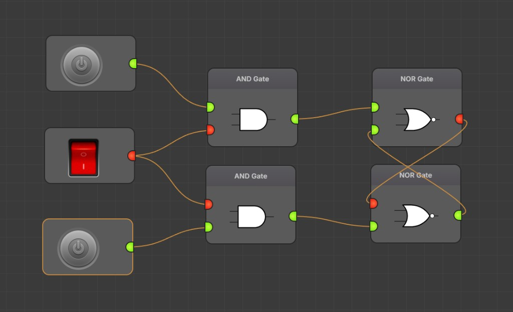

# FlexGates

Welcome! FlexGates is a **playground** for **digital logic**—the same kind of “high / low” or **1 / 0** ideas you see in a first **computer or electronics** course. You get a **workbench** on screen: you **drag parts** from a list, **place** them, and **connect** them with **wires** to build small circuits, just like in many lab simulators, but in your **web browser**.

This edition is a fresh take on the original FlexGates from 2016, rebuilt for **today’s browsers**.

**Screenshot:** a small circuit on the workbench—inputs and **AND** gates up front, and a classic **set–reset (SR) latch** on the right (two **NOR** gates cross-coupled).



---

## If you’re new, start here

1. **Open the app** in your browser (or run it on your computer using the short steps in the next section, if you have the project files).
2. On the **left**, you’ll see **groups of parts**—logic gates, flip-flops, input gadgets (clocks, buttons, switches), and a **probe** to read a signal. Click a **section title** to fold it open or closed.
3. **Drag a part** onto the **gray grid** in the main area. That’s your **circuit board**.
4. **Move parts** by clicking and **dragging** the body of a chip. Click **empty space** to deselect, or drag the **empty background** to **pan** (slide the view around) when you have more than a few parts.
5. **Wire things up**: click an **output** (a little tab on one side) and then an **input** on another part to run a **wire** between them. Wires are drawn **on top** of the chips so you can see the connections clearly.
6. **Inputs** and **outputs** of gates behave like in class: a gate reads its **inputs**, figures out the **output** (AND, OR, NOT, and so on), and that value **flows** along the wire to the next part. Flip-flops **remember** a bit, so you can build **sequential** circuits, not just combinatorial ones.
7. Use the **probe** in the “Output” section to **see** a signal as text (like **true / false**), and try **inputs** (buttons, clock, etc.) to **change** what your circuit is doing.

Take your time—there is no “wrong” order. Try a **NOT** gate, then an **AND**, then add a **clock** and a **D flip-flop** when you’re ready for **synced** behavior.

---

## Running the app from this folder (for students with the code)

If your instructor or a friend shared **this project**, you can run the workbench on your own computer. You do **not** need to know **npm**; the steps below use **pnpm** and a small tool called **Corepack** that comes with a normal **Node.js** install.

### 1. Install Node.js (one time)

Download the **LTS** (long-term support) version for your system from **https://nodejs.org/** and install it. That gives you the **Node** runtime and, on current versions, **Corepack**—we’ll use that in the next step, not the **npm** command.

### 2. Install pnpm (one time, without npm)

Open a **terminal** (or “command prompt” / “PowerShell” on Windows) and run these two lines, one after the other:

```text
corepack enable
corepack prepare pnpm@latest --activate
```

If those commands are **not** found, your Node might be an older one—ask for help, or use the **official installers** for pnpm (no npm required) from **https://pnpm.io/installation** and follow the short instructions for **Windows** or **Mac** / **Linux**.

### 3. Open this project and start FlexGates

In the terminal, **go into** the unzipped or cloned `flexgates-new` folder (the same folder that contains this `README`).

Then run:

- **`pnpm install`** — the **first** time (or after updates), to download the pieces this app depends on. Wait until it finishes.
- **`pnpm dev`** — starts the app and shows a **local** address in the terminal. Open that address in your **browser** (it often looks like `http://localhost:5173`).

### Other commands (optional, later)

- **`pnpm build`** — make a **packaged** version of the app (for “release” or hosting).
- **`pnpm preview`** — **preview** that packaged version in the browser.
- **`pnpm test`** — run the project’s **automated checks** (mainly for people changing the code).

If you have never used a terminal before, ask your **TA or lab** to walk you through “open a folder, run the install once, then run dev”—after that, you can mostly stay in the browser.

---

## License

This project is shared under the **BSD 3-Clause License**, the same kind of open terms as the **original FlexGates** codebase. You’ll find the full legal text in the [`LICENSE`](./LICENSE) file.

If you use FlexGates in a report or video, a short line like *“Used FlexGates to simulate the circuit”* and a **link to this project** is a nice way to say thanks to the people who built and share the tool.

---

## A note about the original FlexGates

The **first FlexGates** (around **2016**) was a small **in-browser** lab for the same kind of play you get here. It used older **JavaScript**, **canvas** drawing in places. This repository keeps the **same license family** and the same **spirit**: drag parts, wire them, and watch the logic do its job. The **old** app may show up in archives or repos under names like **flexgate** or **flexgates**; **this** folder is the **new** one, updated for **today’s browsers** and the codebase in this repository.

---

Happy building—and have fun with your first logic circuits!
